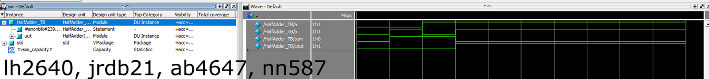
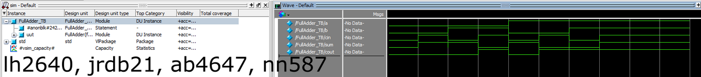
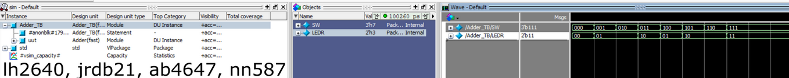

# HDL Adder Simulation

This project implements and tests **Half Adder**, **Full Adder**, and **3-bit Adder** modules in **SystemVerilog** using ModelSim/Questa.


## Files
- `HalfAdder.sv`, `HalfAdder_TB.sv`
- `FullAdder.sv`, `FullAdder_TB.sv`
- `Adder.sv`, `Adder_TB.sv`
- `/images` — simulation waveforms


## Simulations

### Half Adder


### Full Adder


### 3-bit Adder



## Run in ModelSim
```bash
vlog *.sv
vsim <testbench_name>
run 100ns
